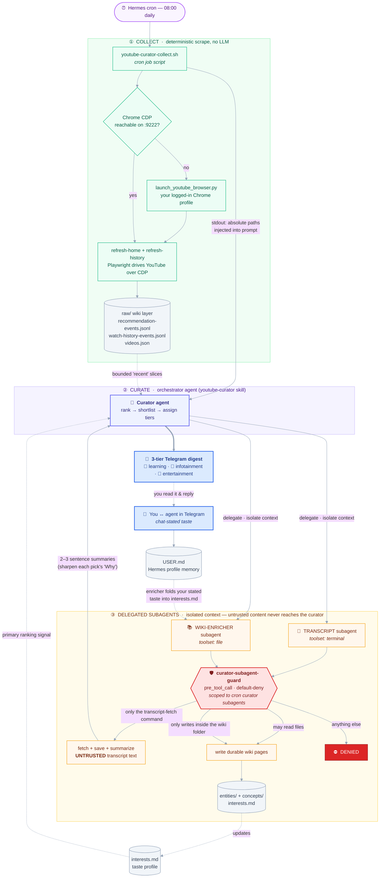

# HermesYoutubeCurator

A personal YouTube recommendation curator that runs as a [Hermes Agent](https://hermes-agent.nousresearch.com) cron job. Each morning it browses *your* logged-in YouTube home feed and watch history, decides what's actually worth your time, and sends a tiered digest to Telegram — then quietly grows a small personal wiki of the topics and channels you keep coming back to.

It is **not a clone-and-run app.** Like other Hermes projects (e.g. [`vigil-crest`](https://github.com/earlgreyhot1701D/vigil-crest)), it's a *configured personal setup*: you bring your own Hermes install, model, Telegram bot, and YouTube login. This repo is the recipe and the portable parts; [`INSTALL.md`](INSTALL.md) is the step-by-step runbook that wires them into your Hermes install.

## What it does

Every run (default 08:00 daily):

1. **Collects** — a headless-ish Chrome session (your logged-in profile, driven over CDP) scrapes your YouTube home feed + watch history into a local raw "wiki" layer. Deterministic; no LLM.
2. **Curates** — the agent reads bounded slices of that raw evidence and produces a three-tier Telegram digest (🧠 Pure learning / 🎤 Infotainment / 🍿 Pure entertainment) with durations and a transcript-grounded "Why" per pick.
3. **Enriches** — durable `entities/` and `concepts/` wiki pages accrete from what you watch, so the curator's taste model improves over time.

## How it works

```
cron (08:00)
  └─ youtube-curator-collect.sh         # launches Chrome (CDP) + runs the collector
        └─ refresh-home / refresh-history  (deterministic scrape → raw/ wiki layer)
  └─ Hermes agent (the "curator"), loading the youtube-curator skill
        ├─ reads bounded `recent` slices of the raw evidence
        ├─ delegates → TRANSCRIPT subagent   (terminal): fetch+save+summarize picks
        ├─ delegates → WIKI-ENRICHER subagent (file):    writes entities/ & concepts/
        └─ writes the 3-tier digest  ──► Telegram
```

Two heavy/untrusted jobs are isolated into delegated subagents so they never enter the curator's context. A `pre_tool_call` guard plugin (`curator-subagent-guard`) hard-restricts those subagents: the transcript one may *only* run the `fetch-transcript` command; the enricher may *only* write under the wiki's `entities/`/`concepts/` dirs — defense-in-depth against prompt injection from untrusted transcript text. See [deploy/plugins/curator-subagent-guard/](deploy/plugins/curator-subagent-guard/).

## Pipeline (detailed flow)



**Reading the diagram:**

- **1 · Collect** is pure scraping — no model. The cron job's script (`youtube-curator-collect.sh`) ensures a logged-in Chrome is up on the CDP port, runs the two deterministic collectors, and writes the append-only `raw/` evidence. Its stdout (a list of absolute wiki paths) is piped into the curator's prompt as ground truth for the run.
- **2 · Curate** is the only place the orchestrator's own context lives. It reads *bounded* `recent` slices of the raw events plus `interests.md` (the taste profile), ranks against them, and builds the tiered shortlist — it never reads the large raw files or transcripts directly.
- **3 · Delegated subagents** run the heavy/untrusted work in throwaway context: the **transcript** subagent ingests untrusted video transcript text (a prime prompt-injection vector), and the **enricher** turns saved transcripts into durable wiki pages. Their toolsets already separate them (transcript has no file tools; enricher has no shell), and the **guard** adds a deterministic, default-deny allowlist on top — so even a fully hijacked subagent can only do its one narrow job. Only the transcript *summaries* (not the raw text) flow back to the curator.
- **Taste feedback loop** (dotted edges) — you steer the curator just by *talking to it*. Chatting with the agent in Telegram updates Hermes' built-in `USER.md` profile memory; on the next run the enricher folds that chat-stated taste into `interests.md`, which is the curator's primary ranking signal. So "more long-form ML, less drama" said in chat shows up as a re-weighted digest the next morning — no skill edits needed.

## Repo layout

```
src/hermes_youtube_curator/        # the Python package (collectors, CLI, persistence)
  cli/collector.py                 #   refresh-home / refresh-history / recent / fetch-transcript
scripts/launch_youtube_browser.py  # launches the logged-in Chrome (CDP) profile
skills/youtube-curator/SKILL.md    # the curator skill (Hub/agentskills.io-compatible)
deploy/
  youtube-curator-collect.sh       # cron launcher (source of truth; @@REPO@@ templated)
  plugins/curator-subagent-guard/  # the security guard plugin (source of truth)
INSTALL.md                         # runbook that wires all of the above into ~/.hermes/
```

The repo is the single source of truth; following [`INSTALL.md`](INSTALL.md) copies the deployable parts into `~/.hermes/`. State (the wiki, the Chrome profile, raw events) lives under `.local/state/` and is git-ignored.

## Getting started

You bring:

- **Hermes Agent** — installed, with a model connected and a **Telegram** bot + home channel
- **`uv`** ([docs](https://docs.astral.sh/uv/)) for the Python env
- **Google Chrome** — for the logged-in scrape (Playwright connects over CDP; no extra download)
- **Python ≥ 3.11**

Then:

```bash
git clone <this-repo> && cd HermesYoutubeCurator
```

…and follow **[`INSTALL.md`](INSTALL.md)** — a verify-as-you-go runbook that wires the deployable parts into your Hermes install and walks you through the manual steps (YouTube login, enabling the guard, gateway restart). Don't have Hermes/a model/Telegram yet? [Step 0](INSTALL.md) links the official sources. Each step says what it's for, what to run, and how to check it — so you can run it yourself or hand the whole file to your agent.

## Notes & limitations

- **Browser-in-cron is the hard part.** Scraping a *personalised* feed needs a real logged-in browser; there's no API for it. We drive a persistent Chrome profile over CDP, which runs reliably under the scheduler (a fresh-headless-per-run approach does not).
- **Model tool-calling matters.** The flow leans on reliable structured tool-calls (two delegations per run). Local models vary: Qwen3.5-9B was reliable; Gemma-4-12B occasionally leaks reasoning-channel tags into output. Pick a model with solid tool-call support.
- **Agent config knobs.** Two settings in `~/.hermes/config.yaml` were essential to stop a local model from runaway tool-loops — set them if you see the agent spinning:
  ```yaml
  agent:
    tool_use_enforcement: false   # don't force a tool call every turn
    reasoning_effort: low
  ```
- **Memory is off for scheduled runs**, so durable taste/format preferences live in the skill, not long-term memory.
- **`uv.lock` is git-ignored by default.** For a reproducible app install you may want to commit it (un-ignore in `.gitignore`) so `uv sync` resolves the exact same dependency versions everywhere.
